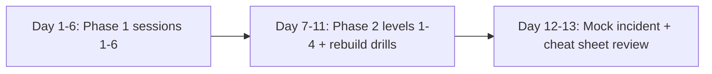

# ClickHouse Perf Engineering: 2-Week Training Plan

**Profile:** strong in Linux, cloud, and Python; weak in database internals. Interview in about 2 weeks.
**Setup:** local Docker, the real ClickBench `hits` dataset, sudo allowed.
**Session format:** I build the scaffold, you fill in the key pieces. Each session ends with interview questions, and `INTERVIEW_CHEATSHEET.md` grows every session.

## Repo layout (I build this in Session 0)

```
practice_db_benchmarking/
├── single/              docker-compose: 1 ClickHouse node (+ Postgres for contrast)
├── cluster/             docker-compose: 2 shards x 2 replicas + 3 Keeper
├── data/                download + load scripts (8M-row sample first, then 100M full)
├── sessions/01..06/     README (goal, steps, "what to watch"), your TODO files, questions
├── bench/               Python harness: concurrency sweep, percentiles, CSV + plot
├── tools/               perf/flamegraph, tc netem, drop_caches, cgroup helpers
├── sabotage/            Phase 2 scripts (hidden from you, run by me)
└── INTERVIEW_CHEATSHEET.md
```

Observability: we use ClickHouse's built-in `/dashboard` and `system.*` tables, plus `htop` and `iostat`. That covers what we need, so no time goes on learning Prometheus or Grafana.

---

## Phase 1: "See it" (6 x 30 min)

| # | Session | What you'll SEE | What you build (TODO) | Interview angle |
|---|---|---|---|---|
| 0 | **Prep (I do it, ~0 min of your time)** | – | – | Compose files, dataset download, smoke test |
| 1 | **Why columnar is fast** | Same query on Postgres vs ClickHouse (seconds vs ms). `ls` into a part directory: one file per column, `.mrk` marks, `primary.idx`. Compression ratio per column from `system.columns`. `EXPLAIN indexes=1` showing "Granules: 12/12000" | Create 2 tables with different `ORDER BY`, predict which query skips more granules, then verify | MergeTree, parts, granules, sparse primary index, why ORDER BY is the #1 design decision |
| 2 | **Where time goes** | `send_logs_level='trace'` showing the read/merge pipeline live. `EXPLAIN PIPELINE` with per-thread streams. `system.query_log` ProfileEvents (bytes read, OS read vs page cache). Cold vs warm run after `drop_caches`, with `iostat` alongside | A query against `query_log` that finds the top 5 heaviest queries by bytes read and says whether each was CPU-bound or IO-bound | "A query is slow, walk me through it": the systematic diagnosis path |
| 3 | **Benchmarking without lying** | `clickhouse-benchmark` at concurrency 1→64. Throughput rises, then flattens while latency explodes (the knee). Run-to-run variance. How cache state flips the results | Fill in the harness: warmup, N repetitions, p50/p95/p99, coefficient of variation, then a 1-page mini report | Methodology: warm/cold, percentiles not averages, isolate variables, reproducibility, ClickBench |
| 4 | **Capacity sizing** | Pin the container to 1/2/4/8 CPUs (`--cpus`, cgroups) and watch scan GB/s scale (or not). Lower the memory limit until a GROUP BY OOMs, then fix it with external aggregation (spill to disk) | A sizing calculator (Python) for "ingest X TB/day, retain 1y, p95 < 1s on query Y": cores, RAM, disk, replicas | Back-of-envelope math from measured per-core throughput and compression ratio |
| 5 | **Distributed** | Bring up the cluster. Insert through a `Distributed` table and watch rows land on shards. `query_log` with `is_initial_query=0` showing fan-out. Replication queue in `system.replication_queue`. Keeper znodes | Write the `remote_servers` config block and choose a sharding key (then see skew from a bad one) | Shard vs replica, Keeper's role, two-phase distributed aggregation, the limits (coordinator bottleneck, large GROUP BY, JOINs across shards) |
| 6 | **Kernel and first chaos** | `perf top` and a flamegraph of ClickHouse mid-query (where the CPU goes: decompression, hashing). Page cache hits vs misses. `docker kill` a replica mid-load. `tc netem` adds 200ms latency to one shard, and the whole query slows to the slowest shard (tail latency) | Write a chaos runbook entry: hypothesis → inject → observe → recover → conclusion | Chaos methodology, tail-at-scale, steady-state hypothesis, blast radius |

**If you only have 4 slots:** do 1+2 merged, then 3+4 merged, then 5, then 6.

---

## Phase 2: Destroy and diagnose (optional, about 5 sessions)

The rule: **I break things silently. You get only a symptom ("dashboard p95 tripled", "inserts failing") and may use only `system.*` tables and OS tools.** You don't read my diffs. Difficulty ramps up.

| Level | Example sabotage (you won't know which) |
|---|---|
| 1. Single fault | `max_threads=1` set in a profile · `PARTITION BY` on a high-cardinality column, causing "too many parts" · bad `ORDER BY` table swapped in · memory limit cut |
| 2. Cluster fault | one replica dead, so its replication queue grows · Keeper loses quorum and tables go read-only · skewed sharding key · `tc` packet loss on one node |
| 3. OS/resource fault | disk 95% full · CPU throttled via cgroup · noisy neighbor running `fio` · stuck mutation eating IO |
| 4. Compound | two faults at once, one of them a red herring |

**Rebuild drills** (destruction rather than addition):
- I delete `cluster/` configs. You rebuild a working 2x2 cluster with Keeper from memory, timed (target < 20 min).
- I drop a replica's data volume. You recover it from the surviving replica.
- I hand you a deliberately bad schema. You redesign it, then prove the improvement with a benchmark.

**Finale (mock interview):** a 60-minute incident plus a capacity report. You get a broken cluster and a business requirement. You deliver a root cause, a fix, before/after benchmark numbers, and a sizing recommendation, then talk it through out loud.

---

## Suggested timeline



## Open decisions

1. **Dataset size:** start on the ~8M-row `hits_v1` sample (fast download), then load the full 100M rows (~15 GB download) in the background for Sessions 3-4. OK?
2. **Postgres contrast** in Session 1: worth the 5 minutes, or skip it?
